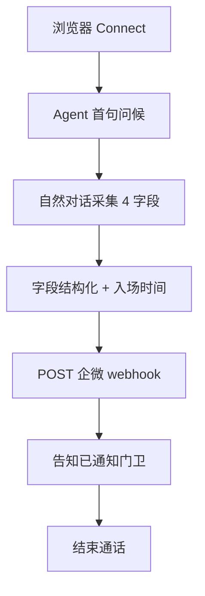
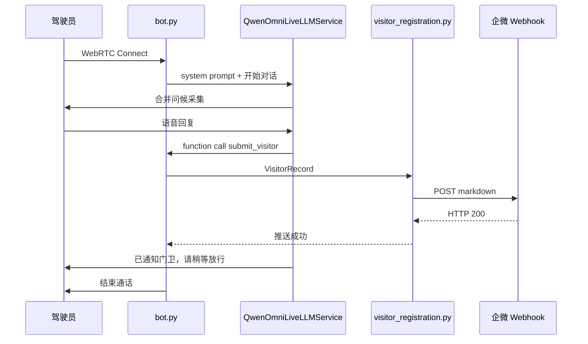

# ExecPlan: 园区访客语音登记 MVP

## Goal

- 目标：交付园区访客车辆语音登记 MVP，WebRTC 本地验证全链路，25 秒内完成企微推送。
- 成功标准：VA-002 Master Exit Criteria 全部满足；自然对话 ✓ 样例通过；企微消息 5 字段齐全。

## Scope and Non-Goals

- 本次范围：
  - 替换 `bot.py` 游戏逻辑为访客登记业务
  - 新增 `visitor_registration.py`
  - 企微 webhook 推送
  - harness 文档与 runbook
- 明确不做：
  - 海康 API、白名单、工作时间、后台、统计 Agent、多语言、声纹、多租户
  - MySQL、Twilio 电话、Pipecat Cloud MVP 验收
  - 修改 `qwen_omni_live_service.py` 协议层

## Scope Freeze

| 类别 | 本次纳入 |
| --- | --- |
| 代码改动面 | `bot.py`、`visitor_registration.py`（新增）、`env.example` |
| 文档 / 配置 / Prompt | `docs/issues/VA-*`、`docs/test/visitor-registration-mvp-runbook.md`、`AGENTS.md`、`project-constraints.md` |

| 类别 | 本次不纳入 |
| --- | --- |
| 顺手优化 | `bot-cascade.py`、upstream README 业务段改写 |
| 范围外问题 | 海康抬杆、MySQL、管理后台 |

| 类别 | 验收口径 |
| --- | --- |
| 功能 | 全链路采集 + 企微推送 + 结束语挂断 |
| 验证 | runbook 3/3 通过，每次 ≤25s，自然对话样例 |

## Context and Orientation

- 当前仓库现状：Pipecat + Qwen Omni Realtime 已接通；`bot.py` 仍运行 Two Truths and a Lie（`game_content.py`）。
- 关键入口：`uv run bot.py` → SmallWebRTC http://localhost:7860
- 可复用：`qwen_omni_live_service.py`（LLM 协议）、Pipecat pipeline 骨架、function call 机制（`end_game` 可改造为 `submit_visitor`）
- 风险与依赖：`WECOM_WEBHOOK_URL` 需可用；25s gate 受 LLM 延迟影响

## 0. 现有架构回顾与核心设计决策

### 真实入口与触发

- `入口命令 / 调用源`：`uv run bot.py`；浏览器 WebRTC Connect 触发会话
- `入口代码位置`：`bot.py` → `run_bot()` → Pipecat `Pipeline`
- `触发条件`：用户点击 Connect，VAD 检测到语音，Qwen Omni 开始对话

### 输入装配与边界校验

- `输入来源`：用户语音流；`.env` 中 `DASHSCOPE_API_KEY`、`WECOM_WEBHOOK_URL`
- `装配位置`：`bot.py` 加载 dotenv；`visitor_registration.py` 读取 webhook URL
- `装配结果`：`VisitorRegistration` 业务对象，含 system prompt、待采集字段状态
- `边界校验`：webhook URL 缺失时记录错误、对话仍可采集但推送失败需明确提示

### 组件职责与代码落点

| 模块/类型 | 新增/复用 | 关键产物 | 职责 | 不负责 |
| --- | --- | --- | --- | --- |
| `bot.py` | 修改 | `run_bot()` | 装配 pipeline、注册 function、启动服务 | 不含业务 prompt 与推送逻辑 |
| `visitor_registration.py` | 新增 | `VisitorRegistration` | prompt、字段抽取、企微推送、结束语 | 不处理 LLM WebSocket 协议 |
| `qwen_omni_live_service.py` | 复用 | `QwenOmniLiveLLMService` | Qwen Omni 实时语音 LLM | 不含园区业务逻辑 |
| `game_content.py` | 废弃（主流程） | — | MVP 不再引用 | — |

### 关键执行时序



- `图示说明`：用户连接后 Agent 主动问候；尽量合并询问减少轮次；采集完成后推送企微并挂断。
- `步骤化时序`：
  1. `bot.py` 启动 pipeline，注入访客登记 system prompt。
  2. 用户说话，Qwen 在自然对话中采集车牌、单位、事由、手机号。
  3. 信息齐全后触发 function call 或内部状态机，构造 `VisitorRecord`。
  4. `visitor_registration.py` 记录入场时间，POST 企微 webhook。
  5. Agent 输出结束语「已通知门卫，请稍等放行」，调用 end 逻辑挂断。

### 停止 / 错误 / 恢复

- `正常停止条件`：4 项对话字段齐全 + 企微推送成功 + 结束语已播报
- `主要错误出口`：webhook 失败、字段缺失、超时 >25s
- `关键分支`：用户一次说出多项信息 → 直接确认缺失项，不重复追问已有字段
- `恢复`：webhook 失败时 Agent 告知「系统繁忙，请稍后再拨或联系门卫」，记录日志

## 1. 访客对话流程 -- prompt 与状态

### 目标与边界

- 这一块要解决什么：中文自然门卫式对话，合并询问，避免机械一问一答
- 这一块明确不做什么：不做企微推送（VA-004）、不做字段校验名单

### 接口 / 结构目标形状

```python
@dataclass
class VisitorRecord:
    plate_number: str       # 车牌号
    company: str            # 来访单位
    phone: str              # 手机号
    reason: str             # 来访事由
    entry_time: datetime    # 入场时间（系统记录）
```

### 实现要点

- system prompt 明确要求：首轮合并问车牌+单位+事由；缺手机号再追问
- 参考 VA-001 ✓ 样例作为 prompt 示例
- 使用 function call `submit_visitor` 在信息齐全时触发（替代 `end_game`）
- 结束语固定：「好的！{车牌}，{单位}{事由}，已通知门卫，请稍等放行。」

### 验证关注点

- 3 轮内完成样例对话
- Agent 不复述机械式逐字段追问
- 字段复述准确

## 2. 企微推送 -- webhook 集成

### 目标与边界

- 这一块要解决什么：5 字段结构化文本推送至企微群
- 这一块明确不做什么：不做消息卡片、不做保安确认回传

### 接口 / 结构目标形状

```python
def push_to_wecom(record: VisitorRecord, webhook_url: str) -> bool:
    """POST markdown 文本至企微 webhook，返回是否 HTTP 200。"""
```

企微消息模板（markdown）：

```text
## 访客登记通知
- **车牌号**：{plate_number}
- **来访单位**：{company}
- **手机号**：{phone}
- **来访事由**：{reason}
- **入场时间**：{entry_time}
```

### 实现要点

- `WECOM_WEBHOOK_URL` 从 `os.environ` 读取，写入 `env.example`
- 入场时间在推送前 `datetime.now()` 记录
- 推送成功后再播报结束语

### 验证关注点

- 企微群收到 5 字段完整消息
- webhook URL 不出现在代码或提交版文档中

## 数据流可视化



- `主路径说明`：采集 → 结构化 → 推送 → 结束语 → 挂断
- `关键分支说明`：字段不全时继续自然追问，不重启流程

## 关键设计决策摘要

- `决策 1`：业务逻辑独立为 `visitor_registration.py`，不修改 `qwen_omni_live_service.py`
- `决策 2`：MVP 仅企微推送，不写 MySQL，降低联调复杂度
- `决策 3`：来访单位自由文本，不做园区名单校验
- `决策 4`：完全替换 game 逻辑，不保留并行

## 与现有代码的关系

- `复用的现有能力`：Pipecat pipeline、Qwen Omni service、function call 框架、SmallWebRTC transport
- `需要新增或改造的模块`：`visitor_registration.py`（新增）、`bot.py`（改造）
- `明确不改的现有模块`：`qwen_omni_live_service.py` 协议层
- `对外行为变化`：从游戏变为访客登记；结束条件从 N 轮游戏变为信息采集+推送完成

## File Map

| 路径 | 新增/修改 | 作用 |
| --- | --- | --- |
| `bot.py` | 修改 | 替换业务装配，移除 game 引用 |
| `visitor_registration.py` | 新增 | prompt、记录、企微推送 |
| `env.example` | 修改 | 增加 `WECOM_WEBHOOK_URL` |
| `docs/issues/VA-003~005` | 新增 | Execution Issues |
| `docs/test/visitor-registration-mvp-runbook.md` | 新增 | 验收 runbook |

## Reference Snippets

```python
# visitor_registration.py — 企微推送核心
import httpx

async def push_to_wecom(record: VisitorRecord, webhook_url: str) -> bool:
    payload = {
        "msgtype": "markdown",
        "markdown": {
            "content": (
                f"## 访客登记通知\n"
                f"- **车牌号**：{record.plate_number}\n"
                f"- **来访单位**：{record.company}\n"
                f"- **手机号**：{record.phone}\n"
                f"- **来访事由**：{record.reason}\n"
                f"- **入场时间**：{record.entry_time:%Y-%m-%d %H:%M}"
            )
        },
    }
    async with httpx.AsyncClient() as client:
        resp = await client.post(webhook_url, json=payload, timeout=5.0)
        return resp.status_code == 200
```

- `片段说明`：推送使用企微 markdown 消息类型，5 字段结构化展示

## Concrete Steps

### 实现步骤

1. **VA-003**：创建 `visitor_registration.py`（prompt + `VisitorRecord`）；改造 `bot.py` 移除 game，注入访客 prompt；实现 `submit_visitor` function call；本地验证自然对话采集。
2. **VA-004**：实现 `push_to_wecom()`；`env.example` 增加 `WECOM_WEBHOOK_URL`；集成推送至 function call 回调；验证企微收到消息。
3. **VA-005**：全链路集成；实现 25s 计时（首句输出 → webhook 200）；执行 runbook 3 次验收；回写脱敏摘要。

### 验证与收口步骤

1. `uv run bot.py` + 浏览器 Connect，跑 VA-001 ✓ 样例对话
2. 检查企微群消息 5 字段
3. 记录 3 次耗时，均 ≤25s
4. 更新 runbook、`writeback_log`、Master Exit Criteria checklist

## Progress

| 日期 | 状态 | 说明 |
| --- | --- | --- |
| 2026-06-11 | in_progress | VA-003/004 代码已落地；待 webhook 配置与 VA-005 验收 |

## Decision Log

| 日期 | 决策 | 原因 |
| --- | --- | --- |
| 2026-06-11 | 来访单位自由文本 | 降低 MVP 复杂度 |
| 2026-06-11 | 仅企微不写 MySQL | 用户确认 MVP 数据出口 |
| 2026-06-11 | 25s 硬性 gate | 用户确认验收标准 |
| 2026-06-11 | 完全替换 game | 用户确认代码策略 |

## Surprises & Discoveries

- （实施时填写）

## Validation and Acceptance

- `uv run bot.py` + http://localhost:7860 Connect
- `docs/test/visitor-registration-mvp-runbook.md` 主路径 3 次
- 25s 计时：Agent 首句 → webhook HTTP 200
- 自然对话 ✓ 样例（VA-001 附录）
- 未验证项：Twilio 电话、Pipecat Cloud（MVP 不做）

## Idempotence and Recovery

- 重复拨打产生多条企微消息（预期行为，MVP 不做去重）
- webhook 失败可重拨；Agent 应提示联系门卫
- 回滚：`git checkout` 恢复 `bot.py`，删除 `visitor_registration.py`

## Harness Control Plane

- Master Issue：VA-002
- Execution Issues：VA-003 → VA-004 → VA-005
- 验证 gate：`make harness-review-gate PLAN=.agents/plans/2026-06-11-visitor-registration-mvp.md`（可选）

## Issue Actions

| Plan Step | Issue | 动作 |
| --- | --- | --- |
| 实现步骤 1 | VA-003 | prompt + 对话流程，无推送 |
| 实现步骤 2 | VA-004 | 企微 webhook 推送 |
| 验证步骤 1-4 | VA-005 | 全链路验收 + runbook |

## Verify Summary

- Pre-review：未执行
- Post-integration：未执行

## Review Summary

- `blocking_findings`: none（文档阶段）

## Writeback Summary

- 2026-06-11：ExecPlan 与 issue 文档已创建

## PR Prep Summary

- （MVP 完成后准备）

## Outcomes & Notify Summary

- （MVP 完成后填写）

## Outcomes & Retrospective

- （MVP 完成后填写）
