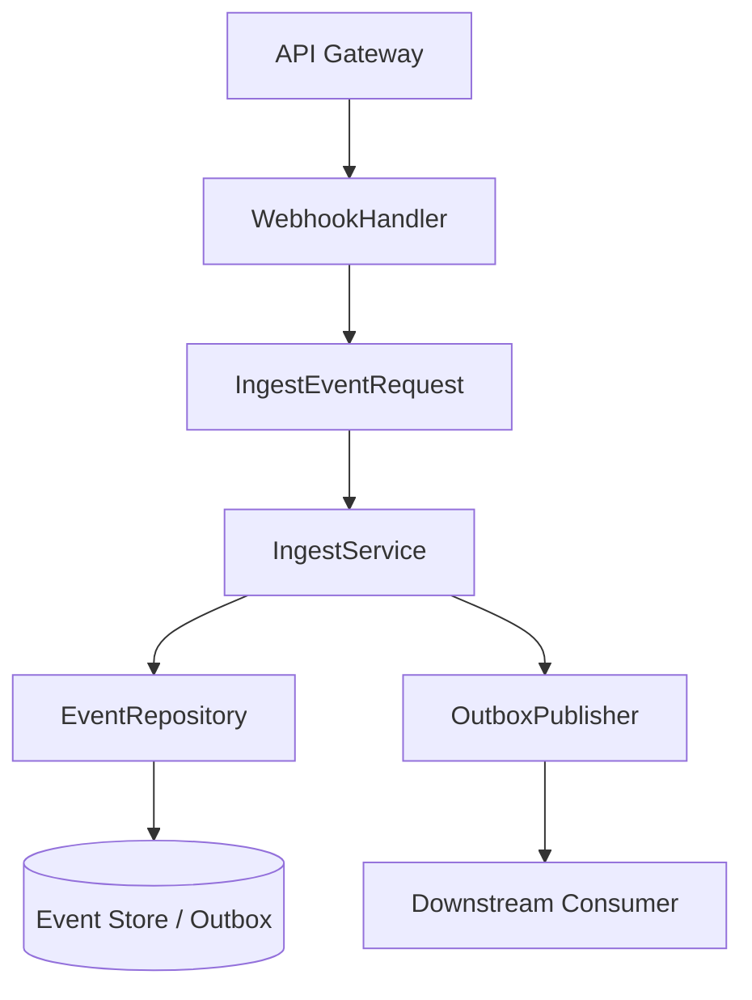
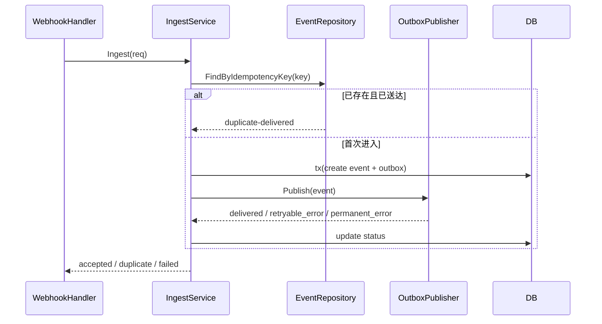

# ExecPlan: Webhook Ingest 幂等与重试升级

## Goal
- 目标：把 webhook 事件接收链路改造成“先校验、再去重、后落盘、最后派发”的实现结构，补齐失败可恢复语义。
- 成功标准：重复事件不会被二次派发；短暂失败可重试；最终结果能写回 execution summary。

## Scope and Non-Goals
- 本次范围：HTTP 入口、事件编排 service、去重状态存储、outbox 派发与执行摘要。
- 明确不做：下游业务 handler 重构、历史脏数据修复、异步批处理平台改造。

## Scope Freeze

| 类别 | 本次纳入 |
| --- | --- |
| 入口 | `POST /webhooks/events` 的请求接收、参数校验与幂等键提取 |
| 编排 | 事件 service 的去重判断、状态推进、派发决策 |
| 持久化 | event store、outbox、重试计数 |

| 类别 | 本次不纳入 |
| --- | --- |
| 下游 handler | 不调整业务处理器内部逻辑 |
| 历史回放 | 不做历史事件补偿脚本 |

| 类别 | 验收口径 |
| --- | --- |
| 主路径 | 首次事件可被持久化并成功派发 |
| 幂等 | 相同幂等键再次进入时不会重复派发 |
| 重试 | 可恢复失败可按重试策略继续执行 |

## Context and Orientation

- 当前仓库现状：现有 webhook 入口直接调用 handler，缺少统一事件 service，重复请求只能依赖下游自行兜底。
- 关键入口文件 / 文档：`cmd/api/main.go`、`internal/http/webhook_handler.go`、`internal/event/outbox.go`、`docs/architecture/webhook.md`
- 可复用组件 / 已有能力：现有 `OutboxPublisher`、`RetryPolicy`、数据库事务 helper 可直接复用。
- 风险、依赖与未决项：需要锁定幂等键优先级；下游返回“已处理”时要明确是否视作成功。

## 0. 现有架构回顾与核心设计决策

### 真实入口与触发
- `入口命令 / 调用源`：第三方平台通过 `POST /webhooks/events` 触发。
- `入口代码位置`：`internal/http/webhook_handler.go` 的 `HandleWebhookEvent`。
- `触发条件 / 上游依赖`：API 网关完成鉴权并把原始请求转发给 webhook handler。

### 输入装配与边界校验
- `输入来源`：HTTP body、header、query 里的 provider 标识和签名信息。
- `装配位置`：`internal/http/webhook_handler.go` 里先解析为 `WebhookEnvelope`，再组装成 `IngestEventRequest`。
- `装配结果 / 核心对象`：`IngestEventRequest{Provider, EventType, IdempotencyKey, Payload, ReceivedAt}`。
- `边界校验`：签名校验失败、payload 反序列化失败、幂等键缺失都直接返回 4xx，不进入事件 service。

### 组件职责与代码落点

| 模块/类型 | 新增/复用 | 关键产物 | 职责 | 不负责 |
| --- | --- | --- | --- | --- |
| `internal/http/webhook_handler.go` | 修改 | `HandleWebhookEvent` | 收口请求解析、签名校验、构造 `IngestEventRequest` | 不负责去重和重试 |
| `internal/event/ingest_service.go` | 新增 | `IngestService` | 编排幂等检查、事务落盘、outbox 派发决策 | 不直接操作 HTTP 响应 |
| `internal/event/repository.go` | 修改 | `EventRepository` | 提供 `FindByIdempotencyKey`、`CreatePendingEvent`、`MarkDelivered` | 不负责业务派发 |
| `internal/event/outbox.go` | 修改 | `OutboxPublisher` | 发送事件、记录失败原因、更新重试次数 | 不负责入口参数校验 |

### 关键执行时序



- `图示说明`：请求从 HTTP 入口进入，先装配统一事件对象，再由 `IngestService` 负责去重、落盘和派发决定。持久化和派发分层独立，避免入口直接串到下游。
- `步骤化时序`：
  1. handler 校验签名并解析请求，构造 `IngestEventRequest`。
  2. service 先按 `IdempotencyKey` 查询现有事件，命中已完成记录则直接返回幂等成功。
  3. 未命中时在事务里写入 `pending` 事件和 outbox 记录。
  4. outbox publisher 尝试派发，下游成功则标记 `delivered`，可恢复失败则累加重试计数并保留重试资格。
- `关键状态推进 / 数据流`：原始 HTTP 请求被归一化为统一事件对象，再被拆成事件表状态和 outbox 派发状态两条数据线。

### 停止 / 错误 / 恢复
- `正常停止条件`：事件被标记为 `delivered`，或命中既有成功记录后返回幂等成功。
- `主要错误出口`：签名失败、参数不合法直接返回 4xx；数据库事务失败或不可恢复派发失败返回 5xx。
- `关键分支 / 降级路径`：下游临时失败时不回滚事件创建，而是保留 `pending_retry` 状态供后台重试。
- `恢复 / 重试 / 回滚`：相同幂等键重放是安全的；事务内写入失败会整体回滚；已写入但未派发成功的记录可由后台 worker 安全重试。

## 1. HTTP 入口层 -- 收口请求与幂等键

### 目标与边界
- 目标：把现有零散的请求解析收口成统一 `IngestEventRequest`，并明确幂等键提取顺序。
- 边界：入口层只处理请求合法性和装配，不承担去重与派发。

### 接口 / 结构目标形状

```go
type IngestEventRequest struct {
    Provider       string
    EventType      string
    IdempotencyKey string
    Payload        []byte
    ReceivedAt     time.Time
}
```

### 实现要点
- 幂等键优先从 header 取，其次从 payload 内已定义字段取，缺失则直接拒绝。
- handler 统一把 provider / event type / payload 归一化后再调用 service。
- HTTP 响应只暴露 `accepted`、`duplicate`、`invalid` 三类结果。

### 验证关注点
- 缺少幂等键必须失败。
- 相同请求重放时入口层不能再次触发下游。

## 2. 事件编排层 -- 去重、落盘与派发决策

### 目标与边界
- 目标：把“是否已有记录、是否允许派发、失败后如何推进状态”统一收敛到 service。
- 边界：不把具体数据库细节泄漏回入口层。

### 接口 / 结构目标形状

```go
type IngestService interface {
    Ingest(ctx context.Context, req IngestEventRequest) (IngestResult, error)
}
```

### 实现要点
- 首次进入时查 `IdempotencyKey`，命中已完成记录则直接返回 `duplicate-delivered`。
- 命中 `pending_retry` 时不重复创建事件，只触发重试调度或返回“已接管重试”。
- 未命中时在事务里写事件表和 outbox，保证状态一致。

### 验证关注点
- 去重命中不同状态时，返回语义要稳定。
- 事务失败时不能留下半条事件记录。

## 3. 存储与派发层 -- 事件状态与重试

### 目标与边界
- 目标：给事件表和 outbox 明确状态字段、重试次数和最后失败原因。
- 边界：不负责业务 handler 本身的执行逻辑。

### 接口 / 结构目标形状

```sql
events(id, idempotency_key, status, delivered_at, retry_count, last_error, payload)
outbox(id, event_id, status, retry_count, next_retry_at)
```

### 实现要点
- `status` 至少区分 `pending`、`pending_retry`、`delivered`、`failed_permanent`。
- 可恢复失败只推进到 `pending_retry`，不可恢复失败推进到 `failed_permanent`。
- `retry_count` 和 `last_error` 由 outbox 层统一维护，避免各调用点各自写状态。

### 验证关注点
- 同一事件不能创建多条有效 outbox 任务。
- 重试次数达到上限后不能再继续投递。

## 数据流可视化



- `主路径说明`：首次事件先落盘，再派发，最终更新状态。
- `关键分支说明`：已送达直接短路返回；可恢复失败只更新为 `pending_retry`，不删除记录。

## 关键设计决策摘要

- `决策 1`：幂等判断放在 service，而不是入口层或下游 handler，原因是要统一状态语义和事务边界。
- `决策 2`：采用“事件表 + outbox”双记录而不是单表直写，原因是要把派发失败和业务事件状态拆开。
- `决策 3`：把可恢复失败保留为 `pending_retry`，而不是直接返回 500 让上游无限重放，原因是要减少重复入站请求和人工补偿成本。

## 与现有代码的关系

- `复用的现有能力`：数据库事务 helper、统一日志组件、现有 `RetryPolicy`。
- `需要新增或改造的模块`：`IngestService`、`EventRepository`、`OutboxPublisher` 的状态推进逻辑。
- `明确不改的现有模块`：API 网关鉴权、中间件日志格式、下游业务 handler 内部实现。
- `对外行为 / 接口 / 配置变化`：HTTP 返回体增加 `duplicate` 语义；新增重试上限配置。

## Reference Snippets

```go
type IngestResult struct {
    Status        string
    EventID       string
    RetryScheduled bool
}
```

```yaml
event_ingest:
  max_retry: 5
  retry_backoff: exponential
  dedupe_key_header: X-Webhook-Id
```

- `片段说明`：前一段锁定 service 的返回形状，后一段锁定重试与幂等配置面。

## Concrete Steps

### 实现步骤
1. 先改 handler，把统一 `IngestEventRequest` 收口出来。
2. 再补 `IngestService`，实现去重、事务落盘和状态推进。
3. 最后改 repository / outbox，补重试计数与失败原因。

### 验证与收口步骤
1. 跑入口单测，覆盖缺少幂等键、重复事件和首次事件三类场景。
2. 跑 service / repository 集成验证，确认事务和状态推进正确。
3. 补 Verify Summary、Review Summary、Writeback Summary 和 residual risks。

## Progress

| 日期 | 状态 | 说明 |
| --- | --- | --- |
| 2026-04-21 | planning | 完成实现方案拆解，待进入编码 |

## Decision Log

| 日期 | 决策 | 原因 |
| --- | --- | --- |
| 2026-04-21 | 幂等判断放在 service | 需要统一状态机与事务边界 |
| 2026-04-21 | 保留 `pending_retry` 状态 | 避免上游无限重放 |

## Surprises & Discoveries

- 当前仓库已有 `RetryPolicy`，但没有把事件状态和 outbox 状态统一抽象。

## Validation and Acceptance

- `go test ./internal/http/... ./internal/event/...`
- `go test ./tests/integration/event_ingest/...`
- 未验证项与原因：真实第三方 webhook 回放需等沙箱环境接入后再补。

## Idempotence and Recovery

- 重跑是否安全：相同幂等键重放安全，重复请求不会创建第二条有效事件。
- 失败后如何恢复 / 回滚：事务失败自动回滚；`pending_retry` 由后台 worker 继续消费；永久失败需人工介入后再重放。

## Harness Control Plane
- `batch_id`: `webhook-ingest-ms1`
- `mode`: `solo`
- `master_issue`: `WEB-120`
- `execution_issue`: `WEB-121`
- `linear_project`: `Webhook Reliability`
- `current_linear_state`: `Todo`
- `branch`: `suqing/webhook-idempotent-retry`
- `pr`: `N/A`
- `state_ref`: `.agents/state/2026-04-21-webhook-ingest.md`
- `latest_run_ref`: `.agents/runs/2026-04-21-webhook-ingest.md`
- `master_run_ref`: `.agents/runs/master-webhook-reliability.md`
- `truth_split`: `Linear primary / repo execution / PR-MR narrative`

## Linear Actions
- `issue_targets`: `WEB-120`, `WEB-121`
- `state_transitions`: `WEB-121 Todo -> In Progress -> In Review`
- `comment_actions`: 在 implementation 开始、verification 完成、review 收口后各回写一次
- `recovery_point`: `IngestService` 主路径落地并通过单测后继续补 outbox 重试
- `next_action`: 先实现统一 `IngestEventRequest` 和 service 主路径
- `summary`: 先交付最小可验证的幂等主路径，再补重试与 writeback

## Verify Summary
- `commands`: `go test ./internal/http/... ./internal/event/...`
- `status`: `pending`
- `owner_agent`: `local`
- `notes`: 需要至少覆盖首次事件、重复事件、可恢复失败三类场景

## Review Summary
- `blocking_findings`: none
- `status`: `pending`
- `scope_guard`: 不顺手改下游业务 handler

## Writeback Summary
- `targets`: `Linear WEB-121`、必要 repo docs
- `linear_feedback_location`: `WEB-121 progress comment`
- `status`: `pending`
- `notes`: 结果面默认写回 Linear

## PR Prep Summary
- `title`: `feat: add idempotent webhook ingest flow`
- `body_sections`: `summary`, `implementation`, `verification`, `risks`
- `result_writeback_location`: `PR body + WEB-121 comment`

## Outcomes & Notify Summary
- `result`: `pending`
- `master_status`: `in_progress`
- `stop_scope`: `stop-current-slice`
- `verification_summary`: `pending`
- `writeback_summary`: `pending`
- `residual_risks`: `真实第三方回放尚未验证`
- `followups`: `补后台 retry worker metrics`

## Outcomes & Retrospective

- 最终结果：待实现
- 遗留项：生产级回放验证、指标与告警
- 后续建议：如果后续 provider 数量继续增加，考虑把幂等键规则和重试策略配置化
