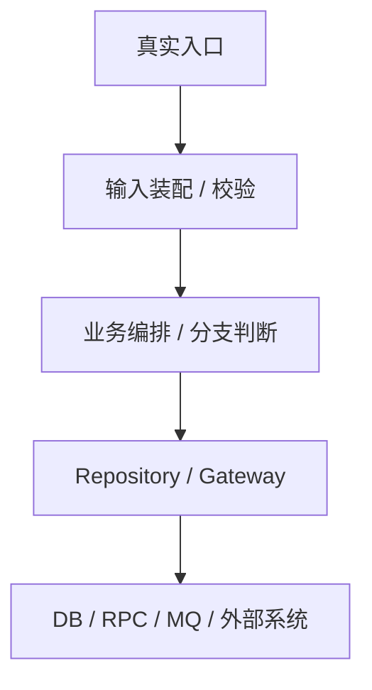
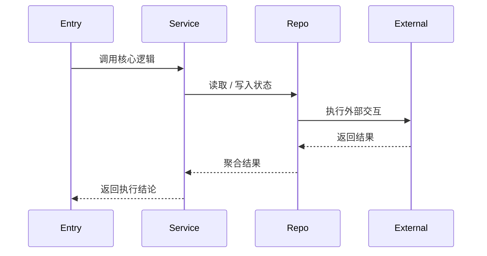

# ExecPlan: <任务名>

## Goal
- 目标：
- 成功标准：

## Scope and Non-Goals
- 本次范围：
- 明确不做：

## Scope Freeze

| 类别 | 本次纳入 |
| --- | --- |
| 代码改动面 |  |
| 文档 / 配置 / Prompt |  |

| 类别 | 本次不纳入 |
| --- | --- |
| 顺手优化 |  |
| 范围外问题 |  |

| 类别 | 验收口径 |
| --- | --- |
| 功能 |  |
| 验证 |  |

## Context and Orientation

- 当前仓库现状：
- 关键入口文件 / 文档：
- 可复用组件 / 已有能力：
- 风险、依赖与未决项：

## 0. 现有架构回顾与核心设计决策

这一节承载旧 `Architecture / Data Flow` 的实现骨架 contract，要求写真实业务实现，不写 harness 控制流。

### 真实入口与触发
- `入口命令 / 调用源`：例如 CLI、handler、cron、consumer 或上游 service
- `入口代码位置`：写真实文件、函数、handler、command 或调度入口
- `触发条件 / 上游依赖`：写本轮切入前提、上游输入、前置资源

### 输入装配与边界校验
- `输入来源`：写参数、配置、事件、上下文对象从哪里来
- `装配位置`：写 config / request / dto / spec 在哪里被组装
- `装配结果 / 核心对象`：写本轮核心对象、DTO、request、plan、task spec
- `边界校验`：写直接拒绝条件、兼容限制、默认值和失败入口

### 组件职责与代码落点

| 模块/类型 | 新增/复用 | 关键产物 | 职责 | 不负责 |
| --- | --- | --- | --- | --- |
| `internal/<module>/entry.go` | 复用 | `EntryPoint` | 接收入口参数并发起本轮编排 | 不负责持久化 |
| `internal/<module>/service.go` | 新增 | `TaskService` | 承接本次核心业务逻辑与关键分支 | 不负责底层驱动 |
| `internal/<module>/repo.go` | 新增/复用 | `Repository` | 收敛外部读写或状态落盘 | 不负责业务编排 |

### 关键执行时序



- `图示说明`：用 2-3 句说清谁触发、关键分层和最终落点
- `步骤化时序`：
  1. 写入口如何拿到输入并进入核心调用链。
  2. 写装配后的关键对象如何进入 service / runner / orchestrator。
  3. 写关键分支如何选择实现路径。
  4. 写结果如何落到 repo、external 或下游回写面。
- `关键状态推进 / 数据流`：写输入如何变成中间对象、最终状态和产物

### 停止 / 错误 / 恢复
- `正常停止条件`：写本轮何时算完成
- `主要错误出口`：写关键错误返回、失败短路或中断点
- `关键分支 / 降级路径`：至少写一个关键分支、兼容分支或降级路径
- `恢复 / 重试 / 回滚`：写失败后如何重跑、恢复、补偿或回滚

## 1. <改动面> -- <本次变更>

### 目标与边界
- 这一块要解决什么：
- 这一块明确不做什么：

### 接口 / 结构目标形状

```go
type <TargetShape> struct {
    // 只保留和本次决策直接相关的字段或方法
}
```

- 这里锁定目标对象、接口签名、配置片段或命令形状

### 实现要点
- 写本改动面准备新增 / 复用哪些类型、函数、配置或文档
- 写关键约束、兼容策略和与其它改动面的衔接方式
- 若这里有分支策略，明确快速路径 / 通用路径 / provider 分支的选择依据

### 验证关注点
- 这一块最容易出错的地方：
- 这一块要怎么验证：

## 2. <第二个改动面> -- <本次变更>

按需继续补 `## 2`、`## 3`、`## 4`，每个改动面都写清目标、目标形状、实现要点和验证关注点。

## 数据流可视化

如果 `## 0` 里的图已经覆盖主路径，这里补关键分支、并发关系、重试链路或写入链路；不要改成 harness 控制流图。



- `主路径说明`：
- `关键分支说明`：

## 关键设计决策摘要

- `决策 1`：写取舍和原因
- `决策 2`：写兼容性、性能或复杂度上的考虑
- `决策 3`：写暂不做的优化点和后续空间

## 与现有代码的关系

- `复用的现有能力`：
- `需要新增或改造的模块`：
- `明确不改的现有模块`：
- `对外行为 / 接口 / 配置变化`：

## File Map（按需）

仅当任务涉及跨目录、多文件面联动、脚本 / 服务 / 配置一起落地时补充。

| 路径 | 新增/修改 | 作用 |
| --- | --- | --- |
| `internal/<path>` | 新增/修改 |  |
| `docs/<path>` | 新增/修改 |  |

## 关键分支与实现策略（按需）

- `分支条件`：
- `主策略`：
- `备选策略 / 降级路径`：
- `不选其它方案的原因`：

## 伪代码 / 主循环（按需）

仅当任务涉及 pipeline、batch、runner、task orchestration、重试、状态机等主循环时补充。

```text
1. 读取输入并构造核心对象
2. 根据关键分支选择执行路径
3. 执行外部读写并聚合结果
4. 更新状态、返回结论、准备收口
```

## 竞态 / 状态机分析（按需）

- `关键状态`：
- `状态推进条件`：
- `竞态窗口 / 并发风险`：
- `避免重复执行 / 保证幂等的方式`：

## Reference Snippets

至少锁定一个与当前关键调用链直接相关的真实接口 / 结构 / 命令 / 配置片段。复杂任务推荐放两段：一段锁定接口 / 结构，一段锁定规则 / 配置 / SQL / CLI。

```text
<贴真实接口 / 结构 / 命令 / 配置片段，不要只留占位说明>
```

- `片段说明`：写这个片段在关键调用链里的作用

## Concrete Steps

### 实现步骤
1. 先补齐最小可运行骨架，再落主路径实现。
2. 再补关键分支、错误处理和兼容逻辑。
3. 最后补必要的文档、验证脚本或回写面。

### 验证与收口步骤
1. 先跑最小验证命令确认主路径通过。
2. 再跑关键分支 / 回归 / review gate。
3. 最后补 Verify / Review / Writeback / Outcomes 摘要。

## Progress

| 日期 | 状态 | 说明 |
| --- | --- | --- |
|  |  |  |

## Decision Log

| 日期 | 决策 | 原因 |
| --- | --- | --- |
|  |  |  |

## Surprises & Discoveries

-

## Validation and Acceptance

- `可执行命令 1`
- `可执行命令 2`
- 未验证项与原因：

## Idempotence and Recovery

- 重跑是否安全：
- 失败后如何恢复 / 回滚：

## Harness Control Plane
- `batch_id`:
- `mode`:
- `master_issue`:
- `execution_issue`:
- `issue_provider`: repo
- `issue_project`:
- `current_issue_state`:
- `branch`:
- `pr`:
- `state_ref`:
- `latest_run_ref`:
- `master_run_ref`:
- `truth_split`: `Issue Tracker primary / repo execution / PR-MR narrative`

## Issue Actions
- `issue_targets`:
- `state_transitions`:
- `comment_actions`:
- `recovery_point`:
- `next_action`:
- `summary`:

## Verify Summary
- `commands`:
- `status`:
- `owner_agent`:
- `notes`:

## Review Summary
- `blocking_findings`:
- `status`:
- `scope_guard`:

## Writeback Summary
- `targets`:
- `issue_feedback_location`:
- `status`:
- `notes`:

## PR Prep Summary
- `title`:
- `body_sections`:
- `result_writeback_location`:

## Outcomes & Notify Summary
- `result`:
- `master_status`:
- `stop_scope`:
- `verification_summary`:
- `writeback_summary`:
- `residual_risks`:
- `followups`:

## Outcomes & Retrospective

- 最终结果：
- 遗留项：
- 后续建议：
